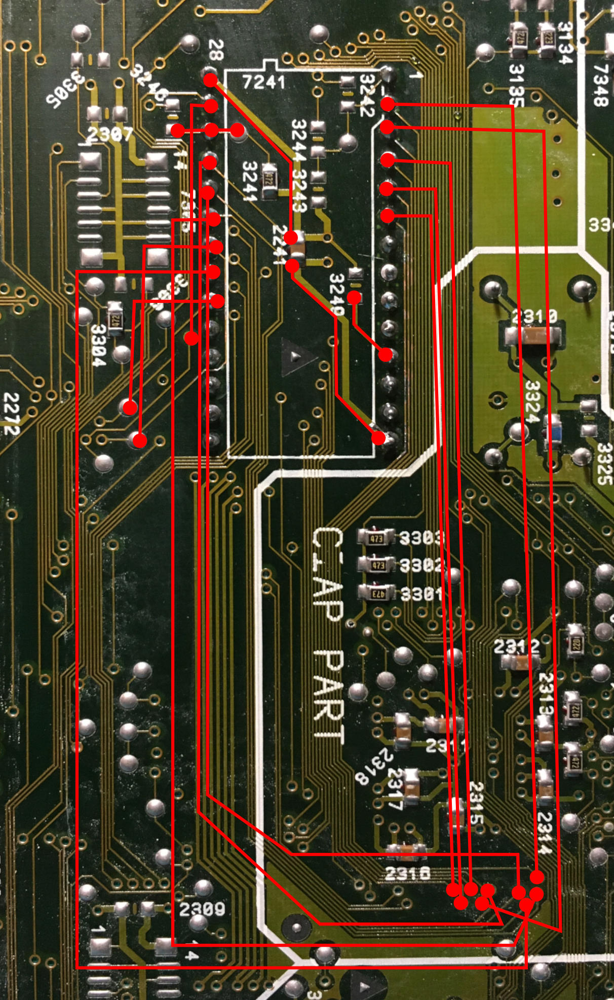

# CD-i 210/40 Timekeeper Traces Repair

One of my CD-i 210/40 consoles [ended up with some broken traces around the ST
Timekeeper chip](https://twitter.com/Micro_Repairs/status/1336015595712733190?s=20)
due to a particularly stubborn leg/through-hole combination.

If you ever get in the same pickle, this somewhat imprecise pinout should tell you
whether any of the timekeeper traces are broken, and where to bodge wire them back.

## Sources

Some source images are available in the [images/ subdirectory](images/).

The SVG file can be edited in Inkscape and contains a layer of traces, a photo I
took of my board, and under all that, the board diagram from the [CD-i 210/40 service manual](http://www.icdia.co.uk/svcmanuals/cdi210.pdf)
(page 76).